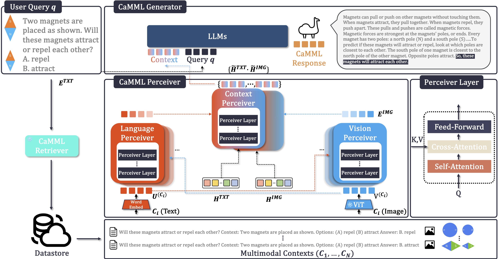
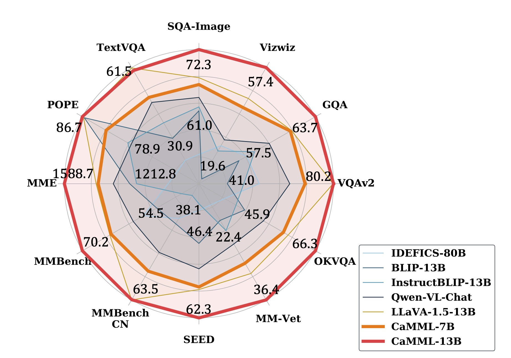
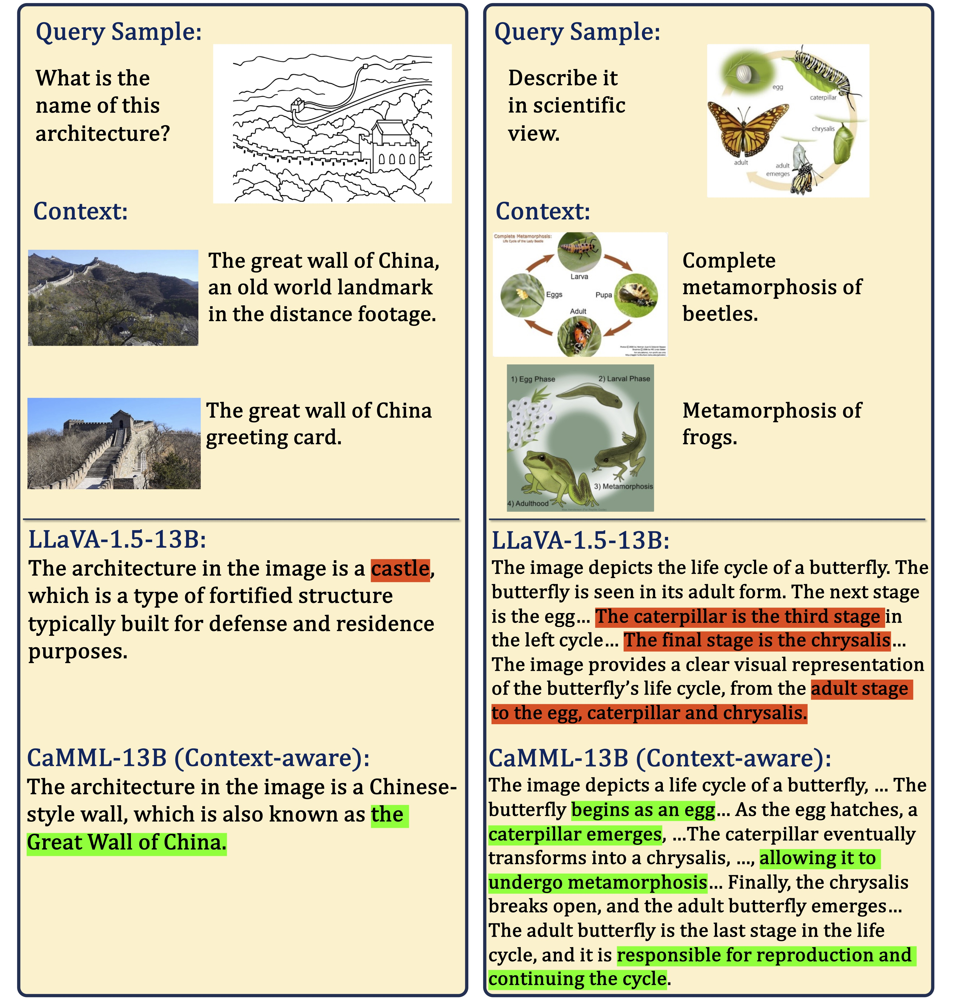
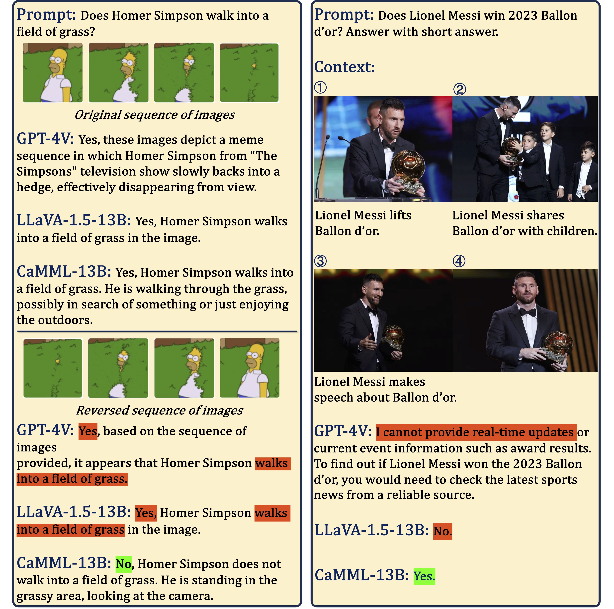
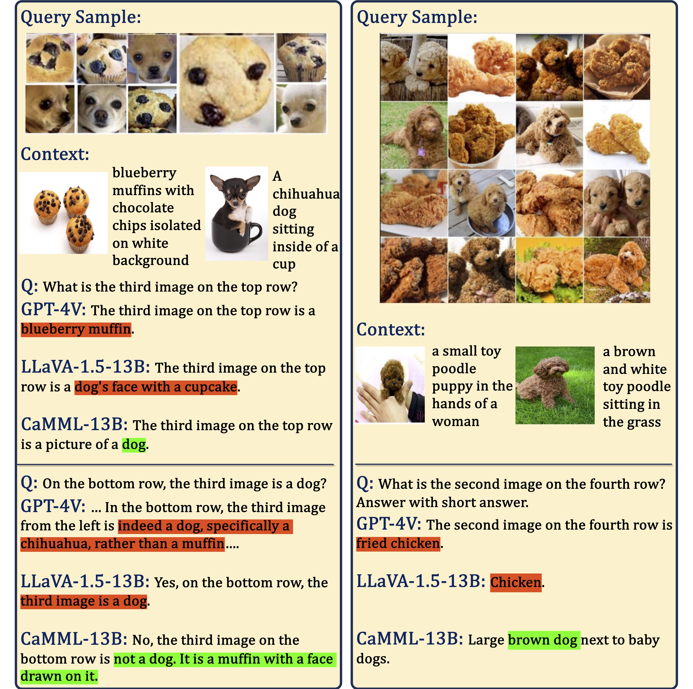
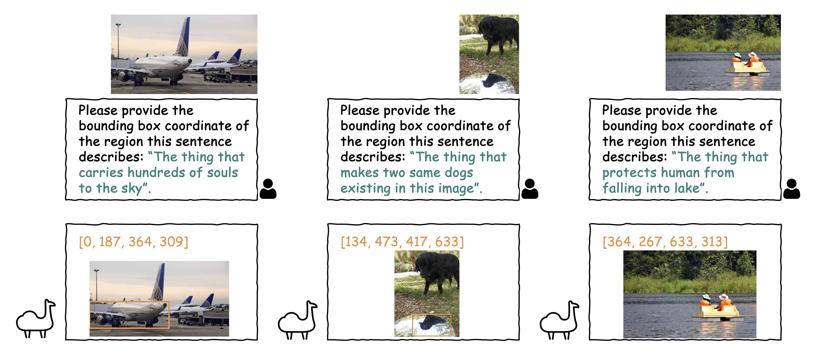

# CaMML: Context-Aware MultiModal Learner for Large Models (ACL 2024)
[](http://arxiv.org/abs/2401.03149)
[](https://camml-project.github.io/)
[](https://github.com/yix-chen/camml?tab=readme-ov-file#demo)
[](https://github.com/yix-chen/camml?tab=readme-ov-file#preparation)
[](https://github.com/yix-chen/camml?tab=readme-ov-file#camml-models)
[](https://github.com/yix-chen/camml?tab=readme-ov-file#citation)

[Yixin Chen](https://yix-chen.github.io/)<sup>1</sup>, [Shuai Zhang](https://shuaizhang.tech/)<sup>2</sup>, [Boran Han](https://boranhan.github.io/)<sup>2</sup>, [Tong He](https://hetong007.github.io/)<sup>2</sup> and [Bo Li](https://aisecure.github.io/)<sup>2,3</sup>.

<sup>1</sup>The Chinese University of Hong Kong, <sup>2</sup>Amazon Web Services, <sup>3</sup>University of Chicago

We received the [SAC Awards](https://2024.aclweb.org/program/best_papers/#sac-awards) from ACL 2024. <br/><br/>

[//]: # ()



CaMML, a lightweight module, is crafted to seamlessly integrate multimodal contextual samples into large models, thereby empowering the model to derive knowledge from analogous, domain-specific, up-to-date information and make grounded inferences.


## Contents
- [Demo](#demo)
- [Install](#install)
- [CaMML Models](#camml-models)
- [Preparation](#preparation)
- [Train](#train)
- [Evaluation](#evaluation)
- [Citation](#citation)
- [Acknowledgement](#acknowledgement)


## Demo

#### Context Aware


#### Contextual Sequences


#### Mitigates Hallucinations


#### Image generation via DALLE3


#### Localization on implicit description


## Install

1. Clone this repository and navigate to CaMML folder
```bash
git clone camml.git
cd camml
```

2. Install Packages
```Shell
conda create -n camml python=3.10 -y
conda activate camml
pip install --upgrade pip  # enable PEP 660 support
bash install.sh
```

3. Install additional packages for training cases
```
pip install flash-attn --no-build-isolation
```


## CaMML Models

### ScienceQA Finetuning

|   Model   | Image Size |       LLM       |   Vision Encoder    | CaMML Retrieval Model | CaMML Retrieval Data |   Train Data    | Finetuning Schedule |                              Model Download                              |  
|:---------:|:----------:|:---------------:|:-------------------:|:---------------------:|----------------------|:---------------:|:-------------------:|:------------------------------------------------------------------------:|
| CaMML-7B  |    224     | Vicuna-7B-v1.3  | CLIP-ViT-L-14-224px |    ImageBind-Huge     | ScienceQA train      | ScienceQA train |  ft_12epochs_2e-5   | [checkpoint]()  |
| CaMML-13B |    224     | Vicuna-13B-v1.3 | CLIP-ViT-L-14-224px |    ImageBind-Huge     | ScienceQA train      | ScienceQA train |  ft_12epochs_2e-5   | [checkpoint]() |


### Instruction Finetuning


|   Model   | Image Size |       LLM       |   Vision Encoder    | CaMML Retrieval Model | CaMML Retrieval Data  |   Train Data    | Finetuning Schedule |                          Model Download                           |  
|:---------:|:----------:|:---------------:|:-------------------:|:---------------------:|:---------------------:|:---------------:|:-------------------:|:-----------------------------------------------------------------:|
| CaMML-7B  |    336     | Vicuna-7B-v1.5  | CLIP-ViT-L-14-336px |    ImageBind-Huge     |    LLaVA-v1.5-665K    | LLaVA-v1.5-665K |   ft_1epoch_2e-5    | [checkpoint]()  |
| CaMML-13B |    336     | Vicuna-13B-v1.5 | CLIP-ViT-L-14-336px |    ImageBind-Huge     |    LLaVA-v1.5-665K    | LLaVA-v1.5-665K |   ft_1epoch_2e-5    | [checkpoint]() |

## Preparation

### Training Dataset

#### ScienceQA
CaMML is finetuned on [ScienceQA](https://scienceqa.github.io/) dataset.
1. Follow ScienceQA [repo](https://github.com/lupantech/ScienceQA) to set up the dataset.
2. Prepare the Data in LLaVA-format.
```angular2html
python scripts/convert_sqa_to_llava.py \
    convert_to_llava \
    --base-dir /path/to/ScienceQA/data/scienceqa \
    --prompt-format "QCM-LEPA" \
    --split {train,val,minival,test,minitest}
```

#### LLaVA-1.5-665K
CaMML is instruction-finetuned on LLaVA-1.5-665K dataset.
Please follow LLaVA instructions to download the annotation of data [llava_v1_5_mix665k.json](https://huggingface.co/datasets/liuhaotian/LLaVA-Instruct-150K/blob/main/llava_v1_5_mix665k.json), and download the images from constituting datasets:

1. COCO: [train2017](http://images.cocodataset.org/zips/train2017.zip)
2. GQA: [images](https://downloads.cs.stanford.edu/nlp/data/gqa/images.zip)
3. OCR-VQA: [download script](https://drive.google.com/drive/folders/1_GYPY5UkUy7HIcR0zq3ZCFgeZN7BAfm_?usp=sharing)
4. TextVQA: [train_val_images](https://dl.fbaipublicfiles.com/textvqa/images/train_val_images.zip)
5. VisualGenome: [part1](https://cs.stanford.edu/people/rak248/VG_100K_2/images.zip), [part2](https://cs.stanford.edu/people/rak248/VG_100K_2/images2.zip)


### CaMML Retriever
We build CaMML Retriever upon [ImageBind](https://github.com/facebookresearch/ImageBind) Models and [AutoFaiss](https://github.com/facebookresearch/faiss) Index tools.
Each data entry is encoded by ImageBind-Huge pre-trained checkpoint and saved using AutoFaiss index.
We provide the processed faiss index with corresponding data json file:
- ScienceQA train: [index](https://camml.s3.us-west-2.amazonaws.com/data/sqa_vision_flatIP.index), [data.json](https://camml.s3.us-west-2.amazonaws.com/data/sqa_train_post_memory_answer.json)
- llava 665K: [index](https://camml.s3.us-west-2.amazonaws.com/data/llava_665k_vision_flatIP.index), [data.json](https://camml.s3.us-west-2.amazonaws.com/data/llava_665k_memory_metadata.json)

For building own customized dataset as source for CaMML Retriever, we provide scripts and examples for generating your own index and embedding:
```angular2html
python scripts/retriever/retriever_embed_llava665k.py
python scripts/retriever/build_autofaiss_index.py
```


### Pretrained Checkpoints
We utilize following models as initialization: 
- [Vicuna-7B-v1.3](https://huggingface.co/lmsys/vicuna-7b-v1.3)
- [Vicuna-13B-v1.3](https://huggingface.co/lmsys/vicuna-13b-v1.3) 
- [Vicuna-7B-v1.5](https://huggingface.co/lmsys/vicuna-7b-v1.5)
- [Vicuna-13B-v1.5](https://huggingface.co/lmsys/vicuna-13b-v1.5)
- [CLIP-ViT-L-14](https://huggingface.co/openai/clip-vit-large-patch14)
- [CLIP-ViT-L-14-336px](https://huggingface.co/openai/clip-vit-large-patch14-336)
- [LLaVA-MM-Projectors](https://github.com/haotian-liu/LLaVA/blob/main/docs/MODEL_ZOO.md#projector-weights)


### Benchmark
We follow [LLaVA preparation](https://github.com/haotian-liu/LLaVA/blob/main/docs/Evaluation.md) to test on 11 tasks (MME, MMbench, GQA, etc.), and organize the data in ```./data/eval```. 
Also, we provide evaluation on COCO caption, Flickr30k caption, OKVQA/A-OKVQA, and RefCOCO/+/g visual grounding, please [download](https://camml.s3.us-west-2.amazonaws.com/data/eval.zip) and add to ```./data/eval```.
### Data Structure

```angular2html
data
├──llava_665k_vision_flatIP.index
├──llava_665k_memory_metadata.json
├──sqa_vision_flatIP.index
├──sqa_train_post_memory_answer.json
├──llava 
│  └── llava_665k
│      ├── coco
│      │   └── train2017
│      ├── gqa
│      │   └── images
│      ├── ocr_vqa
│      │   └── images
│      ├── textvqa
│      │   └── train_images
│      └── vg
│          ├── VG_100K
│          └── VG_100K_2
├──scienceqa
│  ├── images
│  ├── llava_train_QCM-LEPA.json
│  ├── llava_val_QCM-LEPA.json
│  ├── llava_test_QCM-LEPA.json
│  └── llava_test_CQA-A.json
└──eval
   ├── MME
   ├── mm-vet
   ├── mmbench
   ├── mmbench_cn
   ├── pope
   ├── scienceqa
   ├── seed_bench
   ├── vizwiz
   ├── vqav2
   ├── textvqa
   ├── gqa
   ├── cococap
   ├── flickr30k
   ├── okvqa
   ├── aokvqa
   ├── refcoco
   ├── refcocop
   └── refcocog
```

## Train

### ScienceQA Finetuning

Run:
```angular2html
bash scripts/train_camml_7B_sqa.sh
```

e.g.:
```angular2html
torchrun --nproc_per_node=$GPUS_PER_NODE --master_port=$RANDOM \
    llava/train/train_camml_sqa.py \
    --deepspeed "zero3.json" \
    --model_name_or_path ./checkpoints/vicuna-7b-v1.3 \
    --version v1 \
    --data_path ./data/scienceqa/llava_train_QCM-LEPA.json \
    --image_folder ./data/scienceqa/images/ \
    --vision_tower ./checkpoints/clip-vit-large-patch14 \
    --pretrain_mm_mlp_adapter ./checkpoints/llava-pretrain-vicuna-7b-v1.3/mm_projector.bin \
    --mm_vision_select_layer -2 \
    --mm_use_im_start_end False \
    --mm_use_im_patch_token False \
    --perceiver_hidden_size 768 \
    --perceiver_querys 64 \
    --perceiver_layers 2 \
    --icl_num 1 \
    --random_shots_training True \
    --image_aspect_ratio pad \
    --group_by_modality_length True \
    --fp16 True \
    --output_dir ./checkpoints/$file \
    --num_train_epochs 12 \
    --per_device_train_batch_size 8 \
    --per_device_eval_batch_size 1 \
    --gradient_accumulation_steps 1 \
    --evaluation_strategy "no" \
    --save_strategy "steps" \
    --save_steps 500 \
    --save_total_limit 1 \
    --learning_rate 2e-5 \
    --weight_decay 0. \
    --warmup_ratio 0.03 \
    --lr_scheduler_type "cosine" \
    --logging_steps 1 \
    --tf32 False \
    --model_max_length 2048 \
    --gradient_checkpointing True \
    --dataloader_num_workers 0 \
    --lazy_preprocess True
```

### Instruction Tuning
Run:
```
bash scripts/train_camml_7B_665K.sh
```
e.g.:
```
torchrun --nproc_per_node=$GPUS_PER_NODE --master_port=$RANDOM \
    camml/train/train_camml.py \
    --deepspeed "zero3.json" \
    --model_name_or_path ./checkpoints/vicuna-7b-v1.5 \
    --version v1 \
    --data_path ./data/llava/llava_665k/llava_v1_5_mix665k.json \
    --image_folder ./data/llava/llava_665k/ \
    --vision_tower ./checkpoints/clip-vit-large-patch14-336 \
    --pretrain_mm_mlp_adapter ./checkpoints/llava-v1.5-mlp2x-336px-pretrain-vicuna-7b-v1.5/mm_projector.bin \
    --mm_vision_select_layer -2 \
    --mm_use_im_start_end False \
    --mm_use_im_patch_token False \
    --perceiver_hidden_size 768 \
    --perceiver_querys 128 \
    --perceiver_layers 2 \
    --random_shots_training True \
    --image_aspect_ratio pad \
    --group_by_modality_length True \
    --mm_projector_type mlp2x_gelu \
    --fp16 True \
    --output_dir ./checkpoints/$file \
    --num_train_epochs 1 \
    --per_device_train_batch_size 8 \
    --per_device_eval_batch_size 1 \
    --gradient_accumulation_steps 1 \
    --evaluation_strategy "no" \
    --save_strategy "steps" \
    --save_steps 500 \
    --save_total_limit 1 \
    --learning_rate 2e-5 \
    --weight_decay 0. \
    --warmup_ratio 0.03 \
    --lr_scheduler_type "cosine" \
    --logging_steps 1 \
    --tf32 False \
    --model_max_length 2048 \
    --gradient_checkpointing True \
    --dataloader_num_workers 0 \
    --lazy_preprocess True
```


## Evaluation

### CLI Inference

By default, we adopt LLaVA-v1.5-665K dataset as our retriever source.
```angular2html
python camml/eval/run_camml.py --query $QUESTION --image-file $IMAGE_PATH
```

### Benchmarks

#### ScienceQA test
|                                     Model                                      | AVG.  |  IMG  |  TXT  |
|:------------------------------------------------------------------------------:|:-----:|:-----:|:-----:|
|  [CaMML-7B-sqa-FT]()  | 91.32 | 89.24 | 93.21 |
| [CaMML-13B-sqa-FT]() | 92.03 | 89.94 | 93.84 |

#### Vision-Language benchmarks
|     Model     |    LLM     | VQAv2 | GQA  | VizWiz | SQA(I) | TextVQA | POPE |  MME   | MMBench | MMBench-CN | SEED | MM-Vet |
|:-------------:|:----------:|:-----:|:----:|:------:|:------:|:-------:|:----:|:------:|:-------:|:----------:|:----:|:------:|
| [CaMML-7B]()  | Vicuna-7B  | 79.4  | 62.7 |  51.2  |  67.9  |  58.0   | 86.4 | 1506.9 |  66.9   |    60.6    | 60.4 |  32.2  |
| [CaMML-13B]() | Vicuna-13B | 80.2  | 63.7 |  57.4  |  72.3  |  59.9   | 86.7 | 1588.7 |  70.2   |    63.6    | 62.3 |  36.4  |

|     Model     |    LLM     | COCO Cap (CIDEr) | Flickr30K Cap (CIDEr) | OKVQA (Acc) | AOKVQA (MC-Acc) | RefCOCO (Acc) | RefCOCO+ (Acc) | RefCOCOg (Acc) |
|:-------------:|:----------:|:----------------:|:---------------------:|:-----------:|:---------------:|:-------------:|----------------|----------------|
| [CaMML-7B]()  | Vicuna-7B  |      111.4       |         82.7          |    64.7     |      81.1       |     66.6      | 60.3           | 57.6           |
| [CaMML-13B]() | Vicuna-13B |      116.8       |         84.5          |    66.3     |      82.0       |     70.6      | 65.9           | 60.5           |

#### Eval scripts
CaMML supports up to 19 tasks, you can find them in ```scripts/evaluation```.

e.g., Testing ScienceQA finetuning CaMML:
```angular2html
# CaMML-7B, 1 shot
bash scripts/evaluation/sqa_ft_camml.sh camml_7b_sqa_ft 1
# CaMML-13B, 3 shots
bash scripts/evaluation/sqa_ft_camml.sh camml_13b_sqa_ft 3
```


e.g., Testing instruction-tuning CaMML on VQAv2:
```
TASK="vqav2" # mme, mmvet, mmbench, etc.
bash scripts/evaluation/${TASK}_camml.sh camml_7b
```

## Citation

If you find CaMML useful for your research and applications, please cite using this BibTeX:
```bibtex
@misc{camml,
      title={CaMML: Context-Aware Multimodal Learner for Large Models}, 
      author={Yixin Chen and Shuai Zhang and Boran Han and Tong He and Bo Li},
      year={2024},
      journal={The 62nd Annual Meeting of the Association for Computational Linguistics},
      eprint={2401.03149},
      archivePrefix={arXiv},
      primaryClass={cs.CV}
}
```

## Acknowledgement
We build this repo upon following codebases:
- [LLaVA](https://github.com/haotian-liu/LLaVA)
- [FastChat](https://github.com/lm-sys/FastChat)
- [BLIP2](https://github.com/salesforce/LAVIS)
- [ImageBind](https://github.com/facebookresearch/ImageBind)
